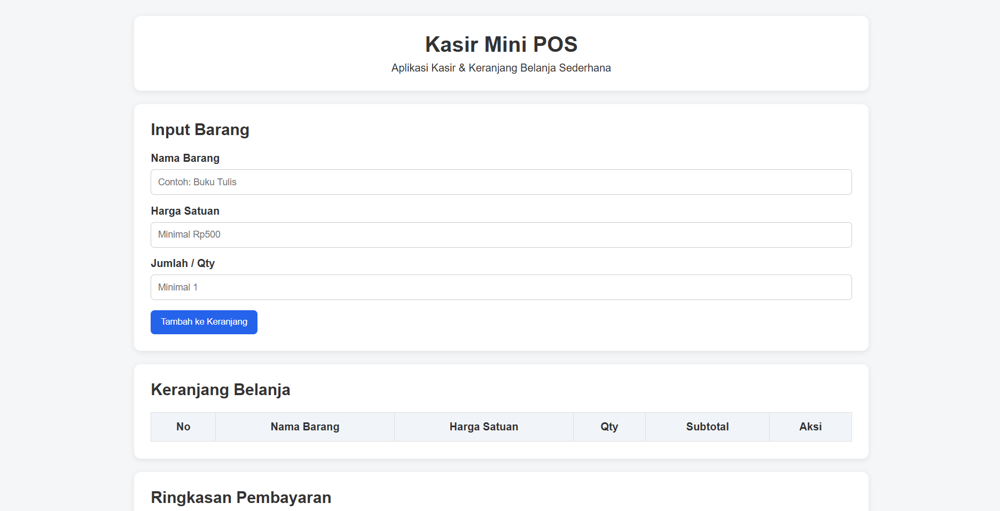
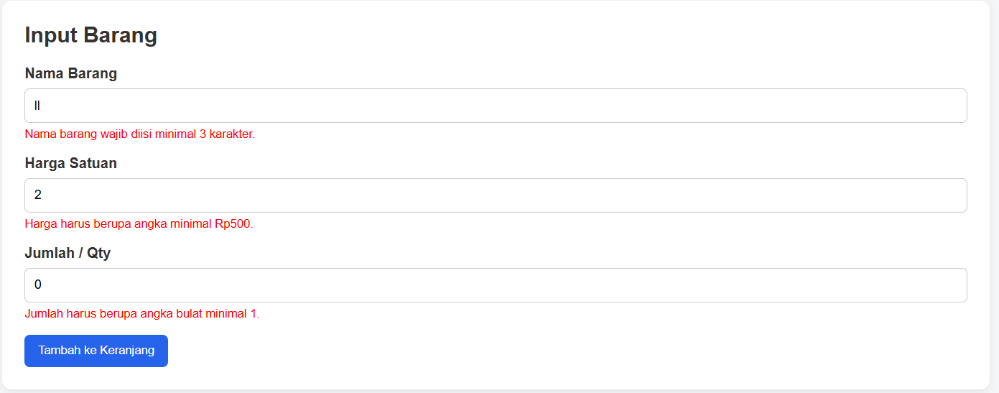
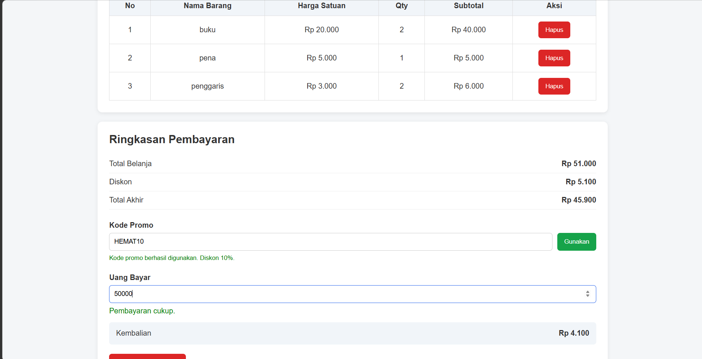

# Aplikasi Kasir & Keranjang Belanja Sederhana

## Identitas

**Nama Lengkap:** Fauzan Habib Pratama  
**NIM:** 124140017  
**Kelas Praktikum:** RB

## Deskripsi Aplikasi

Aplikasi Kasir & Keranjang Belanja Sederhana merupakan aplikasi web Mini POS yang digunakan untuk membantu proses pencatatan barang dan perhitungan pembayaran secara sederhana.

Studi kasus yang digunakan adalah proses transaksi pada kasir, yaitu pengguna dapat memasukkan nama barang, harga satuan, dan jumlah barang. Barang yang telah dimasukkan akan disimpan ke dalam keranjang dan sistem akan menghitung subtotal, total belanja, diskon, total akhir, pembayaran, serta kembalian secara otomatis.

Tujuan pembuatan aplikasi ini adalah untuk menerapkan konsep dasar JavaScript yang telah dipelajari pada praktikum, seperti variabel, percabangan, fungsi, array, objek, event handler, manipulasi DOM, validasi input, serta penyimpanan data menggunakan `localStorage`.

## Panduan Menjalankan

Untuk menjalankan aplikasi pada browser lokal, ikuti langkah-langkah berikut:

1. Download atau clone repository aplikasi.
2. Buka folder proyek menggunakan **Visual Studio Code**.
3. Pastikan file `index.html`, `style.css`, dan `script.js` berada di dalam folder proyek.
4. Buka file `index.html`.
5. Klik kanan pada file `index.html`.
6. Pilih **Open with Live Server**.
7. Browser akan terbuka dan menampilkan aplikasi Kasir & Keranjang Belanja.
8. Aplikasi siap digunakan untuk melakukan simulasi transaksi.

## Daftar Fitur

### Validasi Form

- [x] Validasi nama barang minimal 3 karakter.
- [x] Validasi harga satuan minimal Rp500.
- [x] Validasi jumlah/Qty minimal 1.
- [x] Validasi jumlah harus berupa bilangan bulat.
- [x] Menampilkan pesan error apabila input tidak sesuai.
- [x] Barang tidak dapat ditambahkan apabila terdapat input yang tidak valid.

### Keranjang dan Kalkulator Transaksi

- [x] Menambahkan barang ke dalam keranjang.
- [x] Menampilkan nama barang.
- [x] Menampilkan harga satuan.
- [x] Menampilkan jumlah barang.
- [x] Menghitung subtotal setiap barang secara otomatis.
- [x] Menghitung total belanja secara otomatis.
- [x] Memberikan diskon 10% apabila total belanja minimal Rp50.000.
- [x] Menggunakan kode promo `HEMAT10`.
- [x] Menghitung total akhir setelah diskon.
- [x] Menginput uang pembayaran.
- [x] Menghitung kembalian secara otomatis.
- [x] Menampilkan pesan apabila uang pembayaran tidak mencukupi.
- [x] Menghapus barang dari keranjang.
- [x] Melakukan transaksi baru atau reset keranjang.

### LocalStorage

- [x] Menyimpan data keranjang menggunakan `localStorage`.
- [x] Memuat kembali data keranjang ketika halaman dibuka.
- [x] Mempertahankan data keranjang ketika halaman di-refresh.
- [x] Menghapus data keranjang ketika transaksi baru/reset dilakukan.

## Tangkapan Layar (Screenshot)

### 1. Tampilan Form Input Utama

Screenshot berikut menunjukkan tampilan utama aplikasi yang digunakan untuk memasukkan nama barang, harga satuan, dan jumlah barang.



### 2. Tampilan Validasi Error

Screenshot berikut menunjukkan kondisi ketika pengguna memasukkan data yang tidak sesuai dengan ketentuan validasi. Sistem menampilkan pesan error dan barang tidak dapat dimasukkan ke dalam keranjang.



### 3. Tampilan Hasil Perhitungan

Screenshot berikut menunjukkan barang yang telah dimasukkan ke dalam keranjang beserta hasil perhitungan subtotal, total belanja, diskon, total akhir, pembayaran, dan kembalian.



## Penjelasan Teknis Singkat

### 1. Validasi Input

Proses validasi dilakukan menggunakan JavaScript sebelum data barang dimasukkan ke dalam keranjang. Sistem memeriksa nama barang, harga satuan, dan jumlah barang.

Nama barang harus memiliki minimal 3 karakter, harga satuan harus berupa angka minimal Rp500, sedangkan jumlah barang harus berupa bilangan bulat minimal 1. Jika salah satu data tidak memenuhi ketentuan, sistem akan menampilkan pesan error dan proses penambahan barang dihentikan.

### 2. Algoritma Perhitungan Transaksi

Setiap barang yang dimasukkan ke keranjang memiliki harga satuan dan jumlah barang. Subtotal setiap barang dihitung menggunakan rumus:

```text
Subtotal = Harga Satuan × Qty